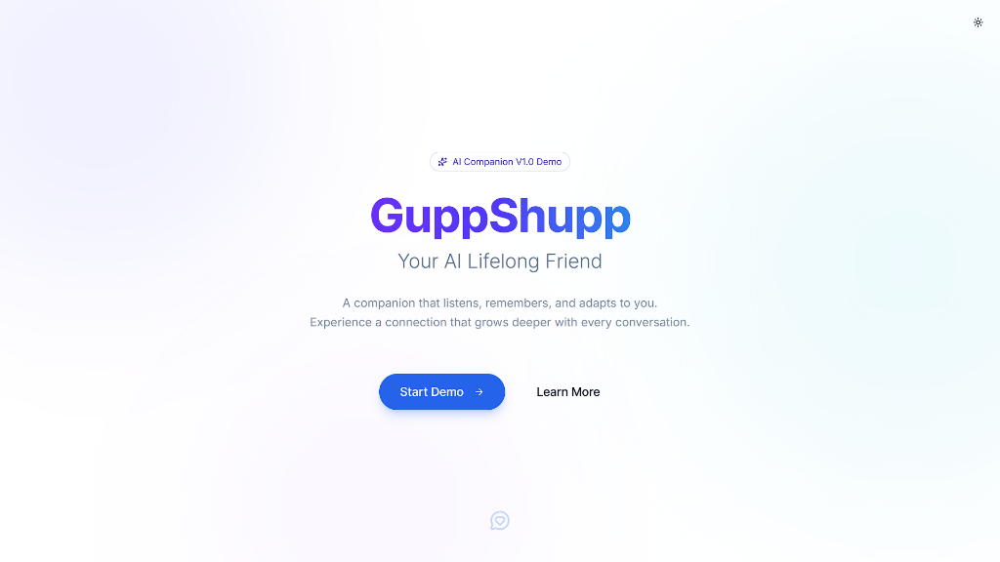
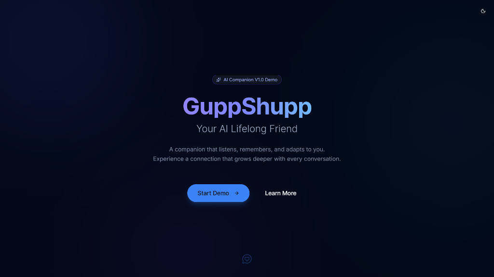
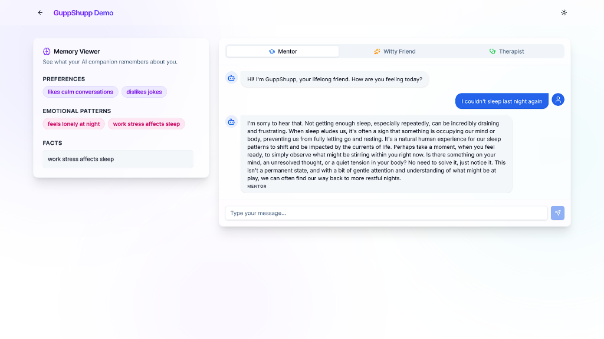
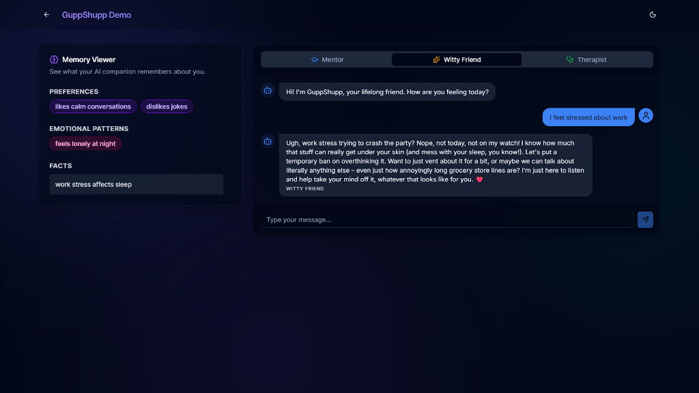

# 🗨️ GuppShupp – AI Lifelong Friend

[](https://guppshupp-ai-assignment.vercel.app/)
[](https://opensource.org/licenses/MIT)

> **A companion that listens, remembers, and adapts to you.**  
> Experience a connection that grows deeper with every conversation.

---

## 🌟 Overview

**GuppShupp** is an intelligent AI companion designed to be more than just a chatbot. It builds a long-term memory of your conversations, adapts to your emotional state, and offers different personas to suit your needs—whether you need a **Mentor**, a **Witty Friend**, or a **Therapist**.

Built with a modern **Next.js** frontend and a robust **Express.js** backend, powered by **Google Gemini AI**.

---

## 📸 Gallery

### 🎨 Landing Page
| Light Mode | Dark Mode |
| :---: | :---: |
|  |  |

### 💬 Chat Interface
| Light Mode | Dark Mode |
| :---: | :---: |
|  |  |

---

## ✨ Key Features

*   **🧠 Long-Term Memory**: The AI remembers details about your life, preferences, and past conversations to provide personalized responses.
*   **🎭 Multiple Personalities**:
    *   **Mentor**: Professional guidance and wisdom.
    *   **Witty Friend**: Fun, casual, and humorous interactions.
    *   **Therapist**: Empathetic, calm, and supportive listening.
*   **🌗 Dark/Light Mode**: Fully responsive UI with seamless theme switching.
*   **⚡ Real-time Interaction**: Fast and fluid chat experience.
*   **💎 Modern UI**: Beautifully designed with **ShadCN UI** and **Tailwind CSS**.

---

## 🛠️ Tech Stack

### **Frontend**
*   **Framework**: [Next.js 14](https://nextjs.org/) (App Router)
*   **Language**: TypeScript
*   **Styling**: [Tailwind CSS](https://tailwindcss.com/)
*   **Components**: [ShadCN UI](https://ui.shadcn.com/)
*   **Icons**: Lucide React

### **Backend**
*   **Runtime**: Node.js
*   **Framework**: [Express.js](https://expressjs.com/)
*   **AI Model**: [Google Gemini 1.5 Flash](https://ai.google.dev/)
*   **Middleware**: CORS, Dotenv

---

## 🚀 Getting Started

Follow these steps to set up the project locally.

### Prerequisites
*   Node.js (v18 or higher)
*   npm or yarn
*   A Google Gemini API Key

### 1. Clone the Repository
```bash
git clone https://github.com/Bijay-Prasad/guppshupp-ai-assignment.git
cd guppshupp-ai-assignment
```

### 2. Backend Setup
Navigate to the backend folder and install dependencies:
```bash
cd backend
npm install
```

Create a `.env` file in the `backend` directory:
```env
PORT=5000
GEMINI_API_KEY=your_google_gemini_api_key
FRONTEND_URL=http://localhost:3000
```

Start the backend server:
```bash
npm run dev
```

### 3. Frontend Setup
Open a new terminal, navigate to the frontend folder, and install dependencies:
```bash
cd frontend
npm install
```

Start the frontend development server:
```bash
npm run dev
```

The application will be available at [http://localhost:3000](http://localhost:3000).

---

## 📂 Project Structure

```
guppshupp-ai-assignment/
├── backend/                # Express server & AI logic
│   ├── index.js            # Entry point
│   ├── llm.js              # Gemini integration
│   ├── memoryExtractor.js  # Long-term memory logic
│   └── ...
├── frontend/               # Next.js application
│   ├── src/
│   │   ├── app/            # App router pages
│   │   ├── components/     # UI Components (Chat, Memory Viewer)
│   │   └── lib/            # Utilities
│   └── ...
└── assets/                 # Project screenshots
```

---

## 🤝 Contribution

Contributions are welcome! Feel free to fork the repository and submit a pull request.

---

Designed & Developed by **Bijay Prasad**